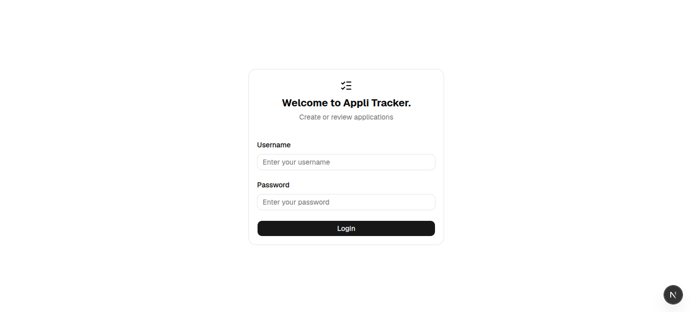
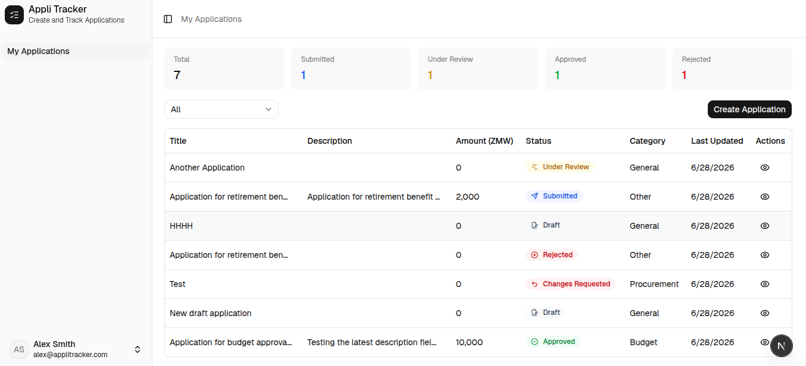
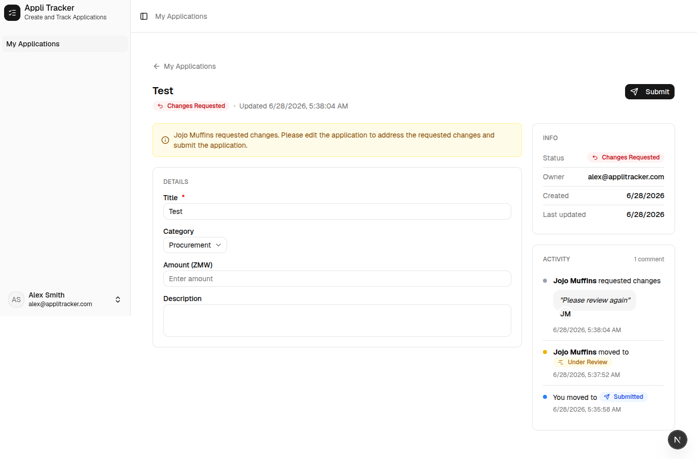

# Appli-Tracker: Submission & Approval Workflow

## Project Description

Appli-Tracker is a small, two-sided web application designed for a generic request submission and approval process. It caters to two main user roles: Applicants and Reviewers. Applicants can create, edit (while in draft), and submit applications, tracking their status through a defined workflow. Reviewers are responsible for reviewing submitted applications, with the ability to approve, reject, or return them for changes, providing comments for each action.

## Features

### Auth + Roles
- **Login:** Supports login for both Applicant and Reviewer roles.
- **Role-based Access Control:** Server-side authorization ensures that users can only perform actions permitted by their role (e.g., an Applicant cannot approve an application).

### Applicant Views
- **Create/Edit Draft Form:** Applicants can create new applications and edit them while they are in a `DRAFT` status. The form includes validation.
- **Submit Application:** Applicants can submit their draft applications for review.
- **"My Applications" List:** A dedicated view for Applicants to see a list of all their submitted applications and track their statuses.

### Reviewer Views
- **Queue List:** Reviewers have access to a queue of all submitted applications, which can be filtered by status.
- **Detail View:** Reviewers can open any application from the queue to view its details.
- **Approve/Reject/Return Actions:** Reviewers can approve, reject, or return an application for changes. Rejection and returning for changes require a mandatory comment.

### Backend API
- **RESTful Endpoints:** Provides a clean and consistent RESTful API.
- **Proper Status Codes:** API responses use appropriate HTTP status codes.
- **Server-side Validation:** All incoming data is validated on the server.
- **Authorization Enforcement:** Every mutation is protected by server-side authorization to prevent unauthorized actions.

### Persistence
- **PostgreSQL Database:** Uses a PostgreSQL database for data storage.
- **Migrations/Seed Script:** Includes database migrations and a seed script for initial data setup.

### Workflow (State Machine & Audit Trail)
- **Backend-enforced State Machine:** The application's core workflow is managed by a state machine on the backend, ensuring that only legal status transitions are allowed.
- **Audit Log:** Every status transition (who, old status → new status, comment, timestamp) is recorded in an immutable audit log and displayed on the application's detail page.

## Non-Functional Requirements

### Tests
- **Unit Tests:** Comprehensive unit tests cover the state-machine transition rules, including both legal and illegal transitions.
- **API Tests:** Includes API tests to assert that unauthorized actions are correctly rejected with a `403 Forbidden` status.

### Authorization
- **Tested, Not Assumed:** Authorization mechanisms are thoroughly tested to demonstrate their effectiveness.

### Clear Error Handling
- **Structured Responses:** Validation errors, illegal transitions, and not-found cases all return structured and user-friendly error responses.
- **Centralized Frontend Error Handling:** Frontend error handling is centralized to provide consistent and informative messages to the user.

## Technology Stack

### Frontend
- **Framework:** React (TypeScript) with Next.js
- **Styling:** Tailwind CSS
- **UI Components:** Shadcn UI
- **State Management/Data Fetching:** Zustand, React Query (implicitly through custom hooks)
- **Icons:** Lucide React
- **Toasts:** Sonner

### Backend
- **Framework:** Django REST Framework (Python)
- **State Machine:** `django-fsm`
- **Authentication:** Django's built-in authentication system
- **Dependency Management:** Pipenv

### Database
- **PostgreSQL**

## How to Run Locally

### Prerequisites
#### Backend
    - Python (https://www.python.org/downloads/) version 3.14.6.
    - Docker (https://docs.docker.com/get-started/get-docker/) and Docker Compose (https://docs.docker.com/compose/install/).
#### Frontend
    - Node (https://nodejs.org/en/download), at least version 22.
    - pnpm (https://pnpm.io/installation).

### Setup

1.  **Clone the repository:**
    ```bash
    git clone git@github.com:rabsonj/appli-tracker.git
    cd appli-tracker
    ```

2.  **Create environment files:**
    Create `.env` files in both the root directory and the `frontend` directory.
    
    **`backend/.env`:**
    ```
    # DEV VARIABLES - Set DEBUG to `False` in production
    DEBUG=True

    SECRET_KEY=django_secret_key
    ALLOWED_HOSTS=localhost,127.0.0.1
    CORS_ALLOWED_ORIGINS=http://localhost:3000
    CSRF_TRUSTED_ORIGINS=http://localhost:8000

    # DATABASE VARIABLES
    DATABASE_URL=postgres://postgres:password@db:5432/database
    POSTGRES_DB=database
    POSTGRES_USER=appli_tracker_user
    POSTGRES_PASSWORD=password
    POSTGRES_HOST=db
    POSTGRES_PORT=5432

    # BACKEND VARIABLES
    PORT=8000
    ```

    **`frontend/.env`:**
    ```
    NEXT_PUBLIC_API_BASE_URL=http://localhost:8000
    ```

3.  **Install frontend dependencies:**
    ```bash
    cd frontend
    pnpm install
    cd ..
    ```

### Running the Application

1.  **Start the backend and database:** (Run this command from the root)
    ```bash
    docker compose --env-file ./backend/.env up -d
    ```
    This will build the backend Docker image, start the PostgreSQL database, run migrations, seed initial data, and start the Django backend server.

2.  **Start the frontend development server:**
    ```bash
    cd frontend
    pnpm dev
    ```
    The frontend application will be accessible at `http://localhost:3000`.

## Live Application

The application is deployed and accessible at: [https://appli-tracker-gray.vercel.app](https://appli-tracker-gray.vercel.app)

### Testing Credentials

You can use the following credentials to test the application:

#### Applicant Accounts
**Applicant 1:**
-   **Username:** `natasha`
-   **Password:** `natasha123`
**Applicant 2:**
-   **Username:** `alexsmith`
-   **Password:** `applicant123`

#### Reviewer Account
**Reviewer:**
-   **Username:** `jojo`
-   **Password:** `reviewer123`

## Data Model and Key Design Decisions

### Data Model

The application revolves around three core models:

1.  **`User` (from `backend/users/models.py`):**
    *   Extends Django's `AbstractUser`.
    *   Introduces a `role` field (`applicant` or `reviewer`) to manage user permissions.
    *   Provides helper properties `is_applicant` and `is_reviewer`.

2.  **`Application` (from `backend/applications/models.py`):**
    *   Represents a request submitted by an Applicant.
    *   **Fields:** `owner` (ForeignKey to User), `title`, `category` (choice field), `description`, `amount`, `status` (FSMField), `created_at`, `updated_at`.
    *   **`status` Field:** Utilizes `django-fsm` to enforce a state machine workflow.
        *   **States:** `DRAFT`, `SUBMITTED`, `UNDER_REVIEW`, `APPROVED`, `REJECTED`.
        *   **Transitions:** `submit`, `start_review`, `approve`, `reject`, `return_for_changes`. These are defined as methods on the model, ensuring business logic is encapsulated.

3.  **`AuditLog` (from `backend/applications/models.py`):**
    *   An immutable record of all status transitions for an `Application`.
    *   **Fields:** `application` (ForeignKey to Application), `actor` (ForeignKey to User), `from_status`, `to_status`, `comment`, `created_at`.
    *   Ensures a complete history of an application's lifecycle.

### Key Design Decisions

#### Backend
-   **Django REST Framework (DRF):** Used for building the RESTful API, providing powerful tools for serialization, views, and routing.
-   **`django-fsm` for Workflow Enforcement:** The `FSMField` and `@transition` decorators in `Application` model ensure that status changes adhere strictly to the defined workflow rules. Illegal transitions are automatically prevented.
-   **Granular Permissions:** Custom DRF permission classes (`IsOwner`, `IsReviewer`, `CanEditApplication`, etc.) are implemented to enforce role-based and state-dependent access control at the API level. The `ApplicationViewSet` dynamically applies these permissions based on the requested action.
-   **Atomic Transitions:** The `_do_transition` helper method in `ApplicationViewSet` ensures that state changes and audit log creation are performed atomically within a database transaction, preventing data inconsistencies. Row-level locking (`select_for_update`) is used to prevent race conditions during concurrent updates.
-   **Separate Read/Write Serializers:** `ApplicationSerializer` (read-only, nested data) and `ApplicationWriteSerializer` (for create/update) are used to optimize data transfer and validation.
-   **Seed Script:** A `seed` management command is provided to populate the database with initial users (2 Applicants and 1 Reviewer), facilitating quick setup and testing.
-   **`drf-spectacular` and `openapi-typescript` (frontend):** Used to generate TypeScript types from the backend models and APIs.

#### Frontend
-   **Next.js for React Application:** Provides server-side rendering, routing, and API routes (though not heavily used for this project's API interaction).
-   **Custom Hooks for Data Management:** The `useApplications` hook centralizes data fetching, filtering, and pagination logic for application lists, promoting reusability and cleaner component code.
-   **Shadcn UI & Tailwind CSS:** Used for building a modern and responsive user interface with a focus on accessibility and design consistency.
-   **Dynamic Column Generation:** The `getColumns` function dynamically generates table columns based on the user's role, tailoring the view for Applicants and Reviewers.
-   **Husky, ESLint, and Prettier:** Configured ESLint for linting, Prettier for code formatting, and Husky (for pre-commit hooks) to automatically lint and format files on commit.

## Trade-offs and Future Improvements

### Trade-offs Made

#### Frontend
-   **Basic UI/UX for Forms:** Forms are functional but could benefit from more advanced UI/UX features like real-time validation feedback (beyond simple error messages).
-   **Limited Filtering/Sorting:** The reviewer queue currently only supports filtering by status. More advanced filtering, searching, and sorting options were not implemented to keep the scope focused.

#### Backend
-   **No File Attachments:** The assignment mentioned optional file attachments. This feature was omitted to prioritize the core state machine and error handling, ensuring a solid foundation within the given time constraints.

#### Security
-   **Simplified Authentication:** While role-based authorization is enforced, the authentication mechanism is basic (username/password login) and lacks features like password reset, email verification, or social logins.
-   **Limited Advanced Security Features:** The current implementation does not include advanced security features such as limiting login attempts within a specific time period, brute-force protection, or more sophisticated session management. This was a conscious decision to focus on the core workflow and functional requirements.

### What Would Be Added or Changed with More Time
-   **Comprehensive Testing:** While core workflow and authorization are tested, expanding test coverage to include more edge cases, integration tests for frontend-backend interaction, and end-to-end tests would significantly improve robustness.
-   **Real-time Notifications:** Implementing real-time notifications (e.g., using WebSockets) for status changes would greatly enhance the user experience for both Applicants and Reviewers.
-   **Advanced User Management:** Adding features for user registration, password management, and potentially an admin interface for managing users and roles.
-   **Frontend Form Library:** Integrating a form library like React Hook Form or Formik could streamline form management, validation, and error display, especially for more complex forms.
-   **Optimistic UI Updates:** For actions like approving or rejecting an application, implementing optimistic UI updates could make the application feel more responsive.
-   **Detailed Audit Log View:** Enhancing the audit log display with more filtering, sorting, and perhaps a visual timeline.
## AI Tools Used

This project was developed with the assistance of AI agents.

### 1. Claude (Chat)
Claude was used in the following ways:
- Code generation: Assisted in scaffolding new components, utility functions, and boilerplate code.
- Debugging: Helped identify and resolve linting errors and warnings.
- UI and Design: At least half of the UI was designed by Claude. It is very good at this.

### 2. Gemini (CLI)
Gemini was used in the following ways:
- Code Review: Reviewing code generating by Claude or written my me.
- Refactoring: Identifying redundant code and refactoring it into components/functions, adding type hints, and adding docstrings/TS Docs.
- Assisted in generating the structure and content for this `README.md` file and summarizing code sections.

### Verification of AI-generated code/text
Every piece of AI-generated code and every suggestion was thoroughly reviewed, understood, and integrated manually. This included:
-   Verifying the correctness and logic of generated code snippets.
-   Ensuring that refactored code maintained existing functionality and introduced no regressions.
-   Confirming that documentation accurately reflected the codebase and project requirements.
-   Testing all changes locally to ensure proper functionality and error handling.

## Examples / Demos

Here are some visual examples and demonstrations of the Appli-Tracker application.

### Screenshots

#### Login Page


#### Applications List (Applicant View)


#### Application Details Page


### Videos

#### Application Creation (Video)
A short video demonstrating the process of creating a new application.
[Watch Video](media/videos/application-creation.webm)

#### Applicant Workflow (Video)
A demonstration of the applicant's journey, from creating to submitting an application.
[Watch Video](media/videos/applicant.webm)

#### Reviewer Workflow (Video)
A demonstration of the reviewer's process, including reviewing, approving, and rejecting applications.
[Watch Video](media/videos/reviewer.webm)

## Conclusion

Appli-Tracker successfully implements a robust, two-sided web application for managing an application submission and approval workflow. By leveraging Django REST Framework for a state-machine-driven backend and Next.js with React for a responsive frontend, the project demonstrates clear separation of concerns, strong authorization enforcement, and a focus on user experience through clear error handling and an audit trail. The design decisions prioritize a solid core over feature breadth, providing a strong foundation for future enhancements.